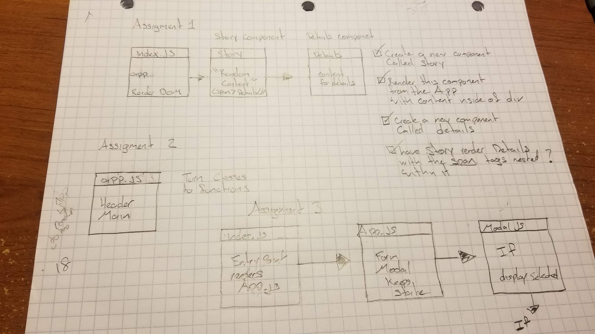

# LAB 29 - Route And Component Comp

### Author: Felipe Delatorre

### Links and Resources
* [submission PR](http://xyz.com)

* [Assigment 1 - Warmups](https://codesandbox.io/embed/lab-29-warmup-mdd7p)

* [Assigment 2 - Modularize and Functionalize](https://codesandbox.io/embed/lab-29-mod-and-func-zzl8z)
* [Assigment 3 - Modal](https://codesandbox.io/embed/lab-29-modal-of0jj)

#### Documentation
  * `npm run styleguide` for each assigment
  
#### Tests
* `npm test`

#### UML

